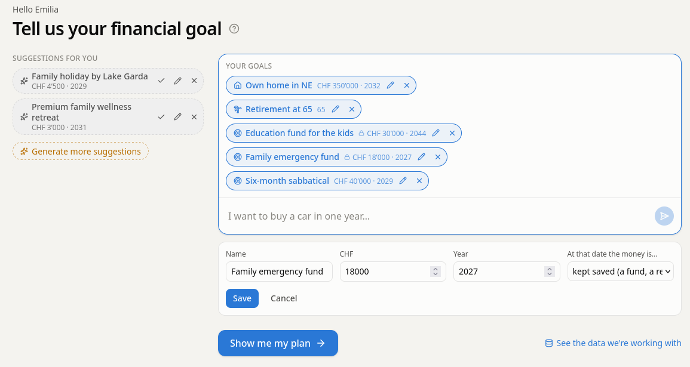
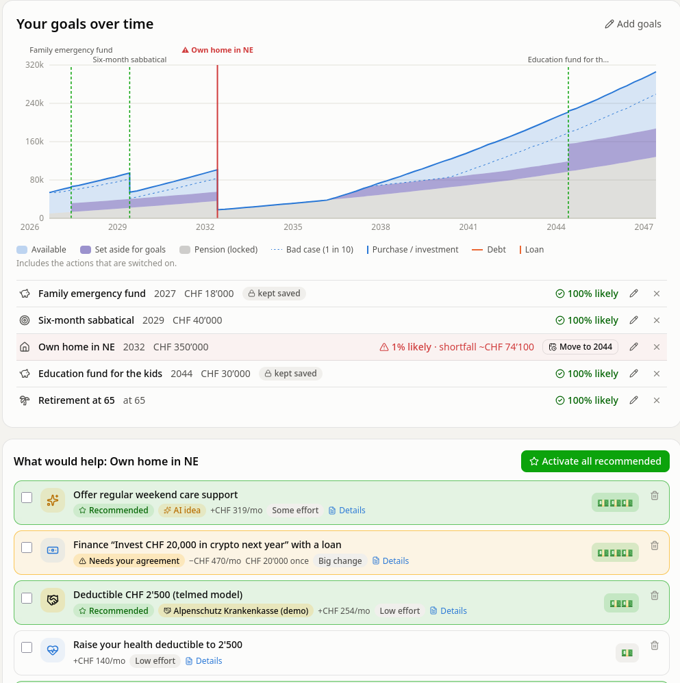
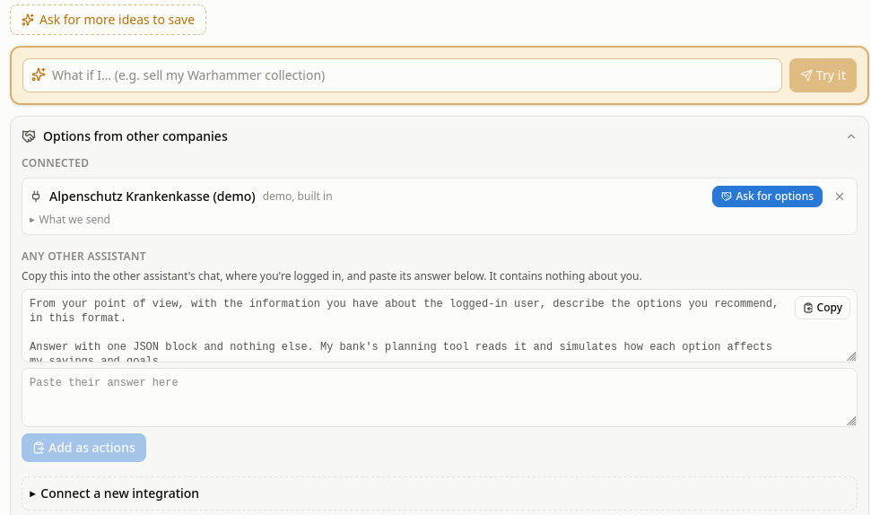

# My Goal, My Plan

**Will my money be enough for what matters to me?**

A financial-stability layer for a bank's customers, originally built for the Finnova hackathon (case 6). It starts from what the
bank already knows, the customer's accounts and transactions, and answers the questions people actually have: where do
I stand, how realistic is my goal, how big is the gap, when does it become critical, what would help most, and how does
one decision change my other goals.

## Who it is for

This is a prototype of a service a bank, who has the right data available, might want to offer their clients.
It might be possible to offer this service standalone, if a way is found to import the data, and if people pay for it.
Clients often have a vague idea that money is getting in and out of the account, but have no patience
for sitting down and averaging exactly how fast they are saving, running the calculations for how this squares with
their life goals, or which interventions have a real chance of bringing their goals closer.
The simulation is sophisticated, but the information is presented in an intuitive way.

## What it does

AI helps every surface or better define what people want every step of the way:

- Suggests goals based on their current financial and life situation: someone who has rent in their payment might want a home
  (and the AI estimates how much this might cost in their canton), someone who spends for baby formula might want to set up an
  education fund for their children, etc.
- Understands free form goals and makes them defined costs with a deadline. 
- Suggests custom interventions: someone who had a second part-time job could restart it, someone who has a very expensive car
  might want to consider downsizing it, someone who spends above the average on travel could put a budget there, etc.
- Helps define the ideas clients come up with. You could knit and sell scarves on Etsy? Ok, let's see how much that typically retails for,
  and what costs and taxes could be.
  
A Monte Carlo simulation accounts for the complexity of the world, but the results are presented with a simple graph:
how much money you have, how much of it is available to spend, how much does each expense set you back. 
The user gets a clear percentage next to each goal; both graph and percentage are recalculated after every choice.

## What to expect

**Goals.** The AI's suggestions wait as ovals to accept, edit or delete; write your own below.


**One chart for all goals.** Spending goals drop out at their date; saved money and pension are locked in their own
colours. Actions are presented to help meet the goal. One option is pushing back the goal to the future, but the AI will
hunt the financial statement for any viable ideas to avoid it. 



**Suggestions and integrations.** The user can ask the AI for more options, suggest more themselves and be helped defining them;
or, in a future of AIs everywhere, connect to other AIs that might have access to different data, such as insurance, to suggest
more exact options. As an universal fallback, we provide a public standard for any chatbot to contribute, with no need for tools.
The user can copy the text and paste back the json response. 



## Try it locally

### Direct run
You need [uv](https://docs.astral.sh/uv/) (it installs Python 3.12) and Node 22 or newer.

```bash
uv sync --all-extras
(cd web && npm install && npm run build)
```

**Quickest start: three made-up customers.**

```bash
uv run python scripts/gen_data.py --all
MYGOAL_DATA_SOURCE=synthetic MYGOAL_DATA_DIR=data/synthetic uv run uvicorn mygoal.api.main:app --port 8080
```

Open <http://localhost:8080>. Lena (31, Zurich) is a good first customer: she wants a flat near Winterthur.

**With the organisers' test data (8,000 people, the default).** Put the CSV files in `testdata/testdata/`, then:

```bash
uv run python scripts/prep_testdata.py        # once, about 40 seconds
uv run uvicorn mygoal.api.main:app --port 8080
```

Type in the customer box to search everyone; starred customers have a story worth looking at.

**Check it works:** `uv run pytest`, about 20 seconds, no AI needed.

### Use podman
`podman build -t mygoal . && podman run -p 8080:8080 --env-file .env mygoal`

### The AI is optional.
Without it everything works, and free-text what-ifs are answered by a simpler rule-based reader.
To switch it on, put `ANTHROPIC_API_KEY` or `OPENAI_API_KEY` in a `.env` file. A local OpenAI-compatible server
(`OPENAI_BASE_URL`) works too.


---

Extending it (new goals, options, data sources), the architecture, the API and the screenshot script are in
[docs/developer-notes.md](docs/developer-notes.md).
